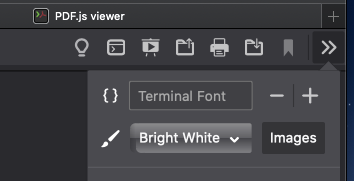

# pdfless

*pdfless* is a customization plugin for [PDF.js][1] web viewer.
It adds a switch for **Terminal mode** where you can change the colors and font
of (non-scanned) PDF files. Read it as if it's on a terminal screen!

## Installation

1. [Download][2] the latest version (or clone this repo)
2. `cd` into the root directory and run `./install.sh`
3. Follow onscreen instructions

## Notes

Define your colors in `./plugin/colors.json` Default colors are taken from the
[Smyck][3] colorscheme.

Turning images off will improve performance and reduce overhead while switching
between Terminal mode and normal view.

*pdfless* does not attempt text-reflow (which is hopeless in PDFs). Resizing the
text changes only the font-size without touching their position. This may result
in disjoint / overlapping text; **this is not a bug**.

Terminal mode is not suitable for complicated PDFs (LaTeX maths, Indic scripts)
because the text layer will mostly contain rubbish. For them as well as scanned
PDFs use the Lights Off switch (which simply inverts the colors) as a fallback.

## Why *pdfless*?

I love reading on the terminal. The dark background, the colors, the monospaced
font are all great for the eyes. But the stuff I have to read mostly are all in
PDFs. PDFs are great for printing; but for reading, they suck. Bright white with
dark text, fixed and rigid. Simply inverting the color is not a great solution;
the font might still suck and images turn into their negative ghosts.

PDF.js renders PDFs as HTML, enabling styling via CSS. *pdfless* adds a custom
mode to the default viewer with controls to modify these styles on the go. Thus,
it makes the PDF *less* rigid and suck *less* while reading. The name is also a
shout-out to the Unix file-viewer utility `less`.

There are PDF readers that does this in other ways (including Adobe reader), but
I couldn't find one satisfactory. Many of them are also bloatwares (especially
Adobe reader) and none of them goes as far as changing the font. PDF.js is small
and runs decently in most modern browsers, requiring no additional software.

[1]: https://mozilla.github.io/pdf.js/
[2]: https://github.com/shivaprsd/pdfless/releases/latest
[3]: https://github.com/hukl/Smyck-Color-Scheme 
