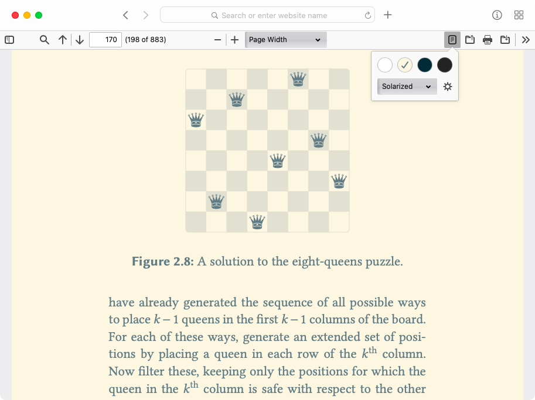
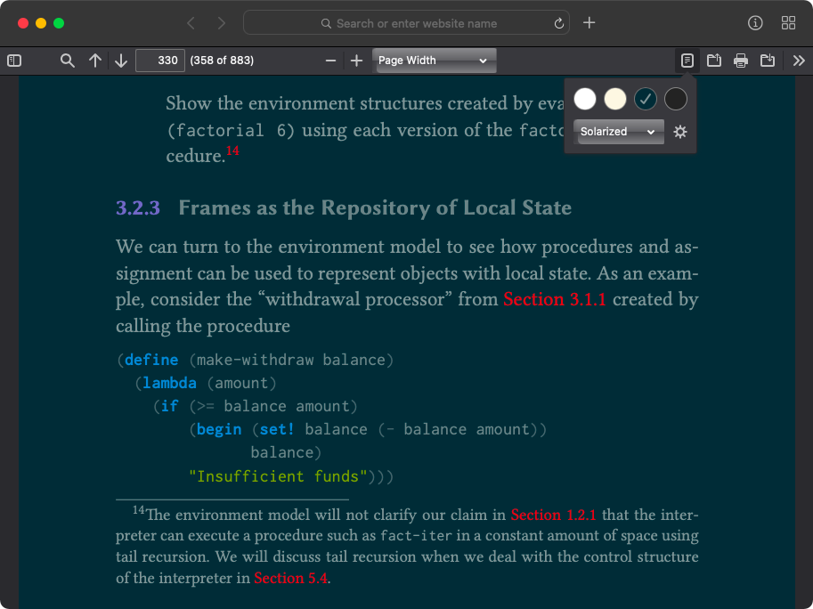
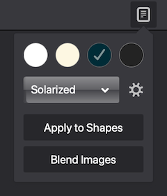

# doq

*doq* (pronounced as *doc-HUE*) is an add-on for Mozilla's excellent
[PDF.js][1] PDF reader.

It adds a **reader mode** where you can change the *colors* of the rendered PDF
files, to make it more comfortable to the eyes while reading. It works similar
to the reader mode in web browsers and theme options in eBook readers (except
that it cannot change the fonts or reflow text).

*doq* was inspired by Safari's Reader View, and many terminal color schemes.





## Usage

*doq* is written as a native [ES6 module][2]; there is no bundled version.
Hence it runs only in modern browsers that supports `import` and `export`.

### Installation

For your own deployment of the PDF.js viewer:

1. [Download][3] the latest version (or clone this repo)
2. Copy the files in the `addon/` directory to some directory on your server\
   (e.g. `/pdfjs-dist/addons/doq/`)
3. Include `doq.js` as a module in the `viewer.html` of your deployment:

```js
<script type="module" src="/path/to/doq.js"></script>
```

*doq* targets the default generic viewer of PDF.js. It should also work in
custom viewers built on top of that. Feel free to open an issue if it breaks in
your viewer.

### Defining colors

Color schemes are defined in `addon/colors.json`, which you can extend. Only
6-digit RGB hex codes are currently supported.

Each color scheme can have up to four tones. `background` and `foreground` will
replace the white and black colors in the document respectively; they also
define the gradient to which the rest of the greyscale gets interpolated. Other
colors map to their nearest color among `accents`, which can be specified per
tone and/or per scheme. They too get mapped to the gradient if no `accents` are
supplied.

Included by default are the Safari Reader View tones and the [Solarized][4]
color scheme.

## Features



- **Reader mode**: applies the selected color scheme and tone to the document's
  background, text and (optionally) to lines and other shapes.

- **Intelligent application**: *doq* does not blindly change text color, but
  tries to ensure the legibility of the text against the background in which it
  is rendered.

- **Blend/invert images**: to mix even images in the document with the new
  background and text colors; can sometimes be helpful for legibility also.

- **Quick-invert** toggle: to simply invert the (original) document colors
  without any processing (if that is all you need).

- **Color-science aware**: *doq* does color transformations in the
  perceptually-uniform [CIELAB color space][5].

- **Accessibility**: the add-on toolbar is designed and tested, following WCAG
  guidelines, to be fully accessible to keyboard/screen-reader users.

- **Remember preferences**: *doq* loads the last used settings upon launch.

### Performance

*doq* recalculates the colors when the page is being rendered by PDF.js. This
incurs a small overhead, slightly reducing the renderer's performance. *doq*
tries to minimize this overhead with many optimizations (like caching the
calculation results) so that speed improves after the initial render. External
benchmark tests are welcome.

This does not apply to the quick-invert mode as no processing is done there; it
is implemented as a simple CSS filter, and hence, is fast.

(I guess this can be avoided altogether by implementing the logic directly
within the PDF.js library by modifying the source. But that requires digging
into PDF.js internals and also building and testing the entire thing, which I
have zero experience with. Hence I chose the add-on route.)

## Why *doq*?

Same reason that lead Ethan Schoonover in developing the Solarized color
scheme: **ergonomics for eyes**. It is best summarized by this quote from the
Solarized Readme:

> Black text on white from a computer display is akin to reading a book in
> direct sunlight and tires the eye.

PDFs are perhaps the single largest source of "black text on white" out there
*that are not amenable to modification*. Designed to look the same everywhere,
the PDF format, unlike EPUB or plain text, does not offer the flexibility of
choosing its appearance while viewing. Yet it is the most popular document
format in existence. Not much talk about ergonomics.

Another point is **accessibility**. The ability to adjust the colors of
documents can be immensly helpful to people with color vision deficiencies or
other low-vision conditions. Document creators are usually *blind* to such
concerns.

The Web is heeding the call, with major browsers now having reader modes, and
more and more websites providing dark/night/low-contrast versions on their own.
But I could find scarcely any efforts in that direction in the domain of PDF
viewing. None of the viewers I tried offered any simple way to change the PDF's
appearance. In the end I decided to create a tool on my own.

### OK, but why *PDF.js*?

Perhaps a web app is still not the best tool to view a PDF document; but they
seem to be getting there. With modern browsers, PDF.js does a decent job, and
is FireFox's built-in PDF viewer. Being familiar with web and JS, I saw it as
the tool that I could quickly extend and develop my solution for, without
needing to pore over thousands of lines of code of a low-level PDF library. It
requires no additional software and is automatically cross-platform, meaning I
could have my solution immediately available on my smartphone also, without
much additional coding.

The limitations do bug me sometimes. I would be delighted to see a *doq*-like
feature added to other popular PDF viewers also. I plan to work towards that
goal in future if time permits.\
*Eye ergonomics matter.*

Suggestions and contributions are welcome!

---

This project started out slightly differently; versions 1.x are now legacy. If
interested, see v2.0 release notes for an overview of what changed, and why.

[1]: https://mozilla.github.io/pdf.js/
[2]: https://developer.mozilla.org/en-US/docs/Web/JavaScript/Guide/Modules
[3]: https://github.com/shivaprsd/doq/releases/latest
[4]: https://ethanschoonover.com/solarized/
[5]: https://en.wikipedia.org/wiki/CIELAB_color_space
